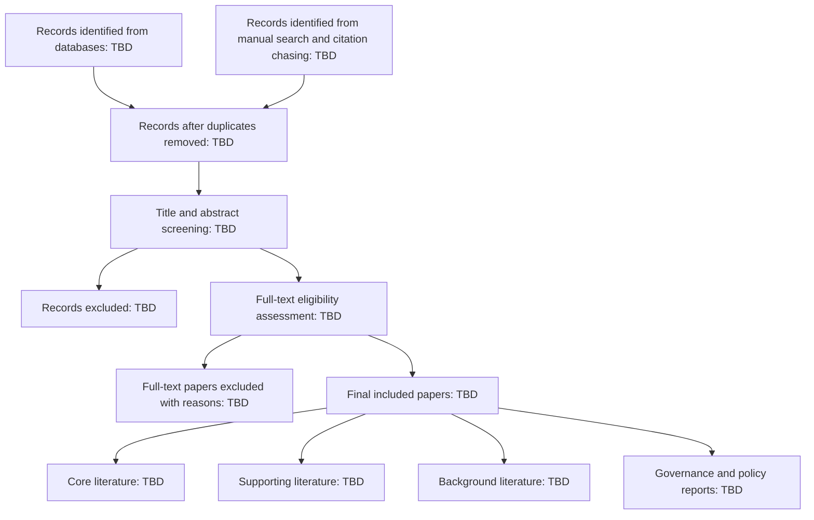

# PRISMA Flow Draft v0.1

This is the initial PRISMA-style flow structure for the Project Aegis living review. The numbers are placeholders until the full search is executed.

## Identification

Records identified from databases:

- arXiv: TBD
- SSRN: TBD
- ACL Anthology: TBD
- ACM Digital Library: TBD
- IEEE Xplore: TBD
- Google Scholar: TBD
- OpenReview: TBD
- Regulatory / policy sources: TBD

Records identified through citation chasing and manual seed papers:

- Seed papers: 12
- Backward citation chasing: TBD
- Forward citation chasing: TBD

## Screening

Duplicates removed: TBD

Records screened by title and abstract: TBD

Records excluded at title/abstract stage: TBD

Common exclusion reasons:

1. Generic stock prediction only
2. Not agent-based
3. Not finance-related
4. No accessible full text
5. Duplicate version
6. Low methodological detail

## Eligibility

Full-text papers assessed for eligibility: TBD

Full-text papers excluded: TBD

Full-text exclusion reasons:

1. No agentic workflow
2. No useful evaluation method
3. No relevance to investment research, risk, auditability, or governance
4. Pure commercial article without methodology
5. Superseded by newer version

## Included

Final included papers:

- Core literature: TBD
- Supporting literature: TBD
- Background literature: TBD
- Governance / policy reports: TBD

## Mermaid draft diagram

## Current seed inclusion

The current manual seed set contains 12 initial papers/reports, stored in `Paper-Database-v0.1.csv`.

## Next task

Execute Search-Round-01 across arXiv, SSRN, ACL Anthology, and Google Scholar using the defined search strings.
