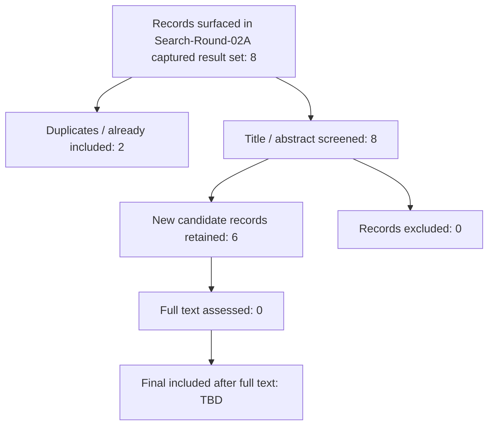

# PRISMA Flow Draft v0.2

## Status

This is a provisional PRISMA-style update after Search-Round-02A.

Important: Search-Round-02A was a **pilot arXiv-focused discovery round using web search restricted to arXiv**, not a full protocol-compliant database search. Search-engine result counts were not available, so this file should not be treated as final PRISMA evidence.

## Identification

Records surfaced in Search-Round-02A captured result set: 8

Sources:

- Web search restricted to arXiv: 8 captured records

Search-Round-02A captured records:

1. P013 Finance Agent Benchmark — duplicate existing
2. P022 StockAgent
3. P023 AFIB / SuperInvesting financial intelligence benchmark
4. P024 StockBench
5. P025 FinRpt
6. P026 TrustTrade
7. P027 TradingGPT
8. P006 FinMem — duplicate existing

## De-duplication

Duplicates / already in database: 2

- P013 already in database
- P006 already in database

New candidate records after duplicate removal: 6

- P022
- P023
- P024
- P025
- P026
- P027

## Screening

Records screened at title/abstract level: 8

Records included as new candidates: 6

Records excluded: 0

Records marked duplicate / already included: 2

## Eligibility

Full texts assessed: 0

Reason: Search-Round-02A only performed title/abstract-level screening using captured arXiv metadata summaries.

## Included

New candidate papers added to working database subset:

- P022 StockAgent
- P023 AFIB / financial intelligence benchmark
- P024 StockBench
- P025 FinRpt
- P026 TrustTrade
- P027 TradingGPT

## Provisional PRISMA diagram

## Interpretation

Search-Round-02A produced useful new candidate evidence, especially:

- P025 FinRpt, which is highly relevant to equity research report generation;
- P024 StockBench, which strengthens dynamic trading benchmark coverage;
- P026 TrustTrade, which strengthens trust / risk-aware trading-agent discussion;
- P027 TradingGPT, which adds memory-agent background.

However, this does not satisfy full Search-Round-02 requirements. The next full round should record exact database result counts, screen at least 50 records, and update PRISMA counts accordingly.

## Next action

Execute full Search-Round-02, starting with arXiv direct search or another source that provides reproducible result counts.
